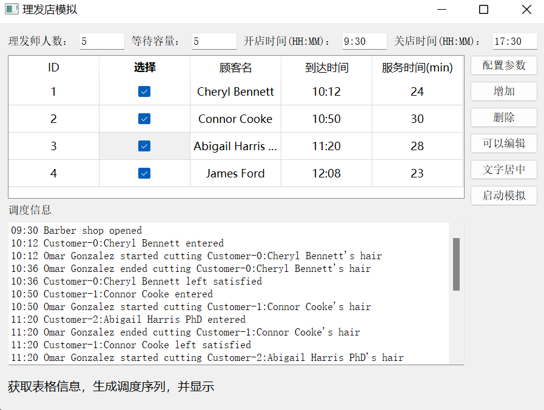

# 模拟理发店运营
> 人工智能辅修--数据结构大作业

## 项目介绍
### 背景

理发店内有K个理发师，有一把长椅用于顾客等待时使用，长椅最多可容纳L个人，顾客到店的时间随机，到店后如果等待位置已满顾客则会直接离开，每位顾客的理发时间均不同（范围处于0-30内），理发店每天的开业时间（t_start）和闭店时间（t_end）可自由设定，开店时间前到达的顾客会直接离开，到达闭店时间时新的客人无法进入，在等待位置的顾客也需要离开。

### 功能要求：
- 每天开店时，可以输入K, L, t_start, t_end的具体数值
- 开店前，通过“新增顾客”选项，随机生成该顾客的到来时间以及理发耗时，模拟理发店经营情况，后增加的顾客到来时间不小于之前一个顾客的到来时间。
- 开店后，通过显示：
  - “顾客i到达，当前时间为x”
  - “顾客i离开，当前时间为x，完成理发/未完成理发”
  - “顾客i开始理发，当前时间为x”
  - “顾客i结束理发x，当前时间为x”
  - “顾客i完成理发，总耗时x”（包含等待时间）

几种状态模拟这一理发过程，在最后闭店时输出理发店全天总服务人数以及理发平均耗时。
- 输入数据形式：K, L, t_start, t_end，第i位顾客到达时间(t_arv_i)与理发时间(t_cut_i)均以整形数字表示。 （例如K=10,L=6,t_start=0，t_end=500，t_arv_20=190,t_cut_20=25） 
- 设计的程序要包含一个简单的界面实现，界面要求：有合理提示，上述每个功能可以设立菜单，根据提示可完成相关的功能要求。
- 测试数据：要求使用1、合法数据；2、非法数据。进行程序测试，以保证程序的稳定，测试数据及测试结果请在上交的资料中写明。

## 运行
- clone
```shell
git clone https://github.com/lif314/BarberShopSimulator.git
```

- install
```shell
pip install -r requirements.txt
```

- run
```shell
python BarberShopSimulator.py
```

## 打包
```shell
pyinstaller -F -i .\bslogo.ico -w .\BarberShopSimulator.py
```

## 展示

